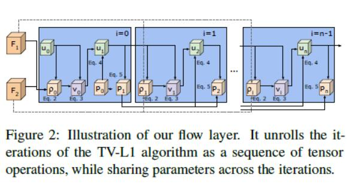
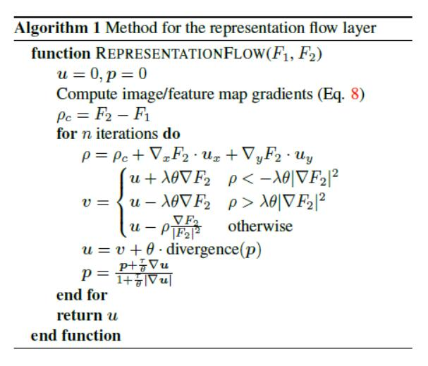
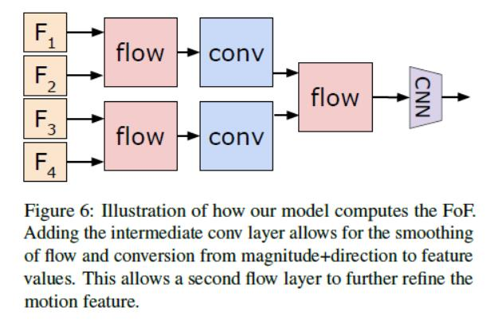
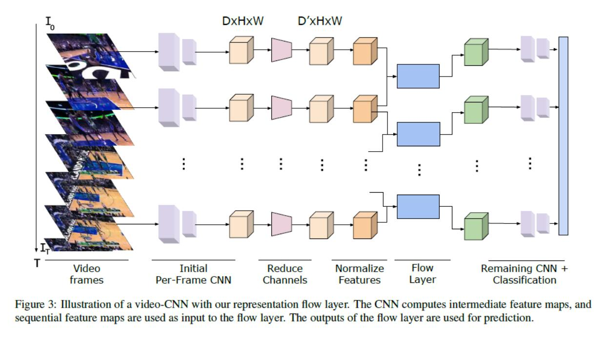

# RepresentationFlowActionRecognition
 百度顶会论文复现--Representation Flow For Action Recognition
# 论文心得
## 摘要
由光流算法得启发，提出了一种光流表示的卷积层。将该卷积层与传统的CNN结合在一起，提高了动作识别的能力。实验中，与传统的识别模型相比，无论在计算速度还是在表现上都具有很大的优势。
## 相关方法介绍
###CNN是最主要的方法：
1. 双流网络：RGB 与 光流
2. 3D时空卷积
3. I3D：XYT + RGB + flow

缺点：Flow计算代价高，Flow和CNNs需要并行，实时性差
###很早之前的方法
4. ActionFlowNet/motion feature networks： 虽然在计算速度和参数数量上由很大的优势，但是与双流网络相比表现能力很差。
## paper提出的方法
不需要计算光流，提出了representation flow layer 能够捕获光流，光流参数与模型参数同时学习。通过堆叠表示光流层实现了flow to flow 的表现。
## 光流计算方法
光流的计算基于亮度一致性假设。给定两种图片$I_1$,$I_2$,$I_1$中的点x，y在图片$I_2$的位置为$x+{\Delta}x,y+{\Delta}y$.而且要求这两张图片只有微小的移动。那么近似的泰勒表示：${I_2}={I_1}+\frac{{\delta}I}{{\delta}x}{\Delta}x+\frac{{\delta}I}{{\delta}y}{\Delta}y$,$u=[{\Delta}x,{\Delta}y]$.解算出u就是其光流。

## 光流表示层
这是一个基于传统的光流算法延申出的完全可微的，能够学习的，卷积表示层。与传统主要的不同：
1. 能够获得卷积特征图的光流
2. 能够学习光流的参数${\theta},{\lambda},{\tau}$

为了减少计算时间，做了3个改变：
1. 单尺度
2. 在微小的空间尺寸上在卷积层张量上计算光流。
3. 不进行任何包装

使用低分辨率来对CNN特征图计算flow
## CNN的光流表示

由许多卷积层（蓝色的盒子）组成，共享一套参数，每一层的行为是依靠前一层。

根据公式，这个层能够完全可微，学习相关的参数$({\tau}, {\lambda},{\theta})$和距离权值${\omega}_x,{\omega}_y$.这样就能够最优化这个任务了。
## 计算 flow
光流算法是计算两张连续图片的相似行为，事实上，由于不一致的光流结果这会导致一个差的效果。而光流层是从数据学习而来，能够减小不一致性，能够更好的呈现行为。

通过堆叠多个表示层，模型能够捕获出更长的时间间隙和行为一致性的位置。

# 代码要点